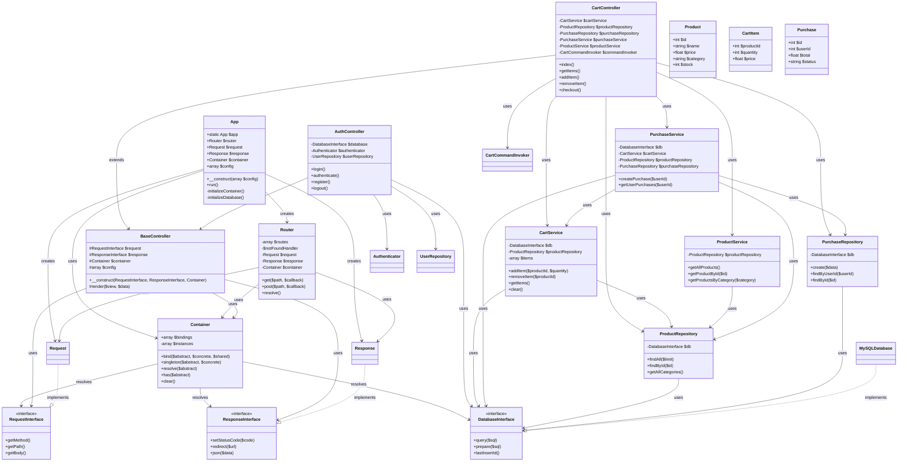

# Diagrama de Clases del Proyecto

## Notas del Diagrama

1. **Core Classes**
   - `App`: Clase principal que inicializa la aplicación
   - `Container`: Gestiona la inyección de dependencias
   - `Router`: Maneja el enrutamiento de la aplicación

2. **Interfaces**
   - `RequestInterface`: Define la interfaz para las peticiones HTTP
   - `ResponseInterface`: Define la interfaz para las respuestas HTTP
   - `DatabaseInterface`: Define la interfaz para la base de datos

3. **Controllers**
   - `BaseController`: Controlador base con funcionalidad común
   - `CartController`: Maneja operaciones del carrito
   - `AuthController`: Gestiona la autenticación

4. **Services**
   - `CartService`: Lógica de negocio del carrito
   - `ProductService`: Lógica de negocio de productos
   - `PurchaseService`: Lógica de negocio de compras

5. **Repositories**
   - `ProductRepository`: Acceso a datos de productos
   - `PurchaseRepository`: Acceso a datos de compras

6. **Models**
   - `Product`: Modelo de producto
   - `CartItem`: Modelo de item del carrito
   - `Purchase`: Modelo de compra

## Relaciones Principales

1. **Inyección de Dependencias**
   - El `Container` resuelve todas las dependencias
   - Los controladores reciben sus dependencias vía constructor
   - Los servicios reciben sus dependencias vía constructor

2. **Herencia**
   - Los controladores extienden de `BaseController`
   - Las implementaciones concretas implementan interfaces

3. **Composición**
   - `App` compone `Container`, `Router`, `Request` y `Response`
   - Los servicios componen sus respectivos repositorios
   - Los controladores componen los servicios que necesitan 