# 📚 Documentación Técnica - Sistema de Fidelización

## 1. Arquitectura General

- **Backend:** FastAPI (Python)
- **Frontend:** PHP (integración vía API REST)
- **Base de datos:** MySQL
- **Testing:** Pytest

## 2. Estructura de Carpetas

- `models/` — Modelos SQLAlchemy y Pydantic (usuarios, transacciones, recompensas)
- `services/` — Lógica de negocio (scoring, transacciones, recompensas, marketing, notificaciones)
- `routes/` — Endpoints FastAPI (usuarios, transacciones, recompensas, avanzados)
- `utils/` — Utilidades (DB, generador de códigos, cálculo de niveles)
- `tests/` — Tests unitarios, integración, rendimiento y flujos de usuario

## 3. Motor de Scoring y Niveles

- **LoyaltyEngine:** Calcula el score de usuario basado en:
  - Frecuencia de visitas
  - Monto gastado
  - Recencia
  - Variedad de productos
  - Referidos
- **Niveles:**
  - Café Bronze, Plata, Oro, Diamante
  - Cada nivel otorga beneficios y multiplicadores de puntos

## 4. Principales Endpoints API

- `GET /api/v1/loyalty/profile/{user_id}` — Perfil de usuario
- `POST /api/v1/loyalty/earn-points` — Ganar puntos
- `POST /api/v1/loyalty/redeem-reward` — Canjear recompensa
- `GET /api/v1/loyalty/rewards` — Listar recompensas
- `POST /api/v1/loyalty/referral` — Generar código de referido
- `GET /api/v1/loyalty/transactions/{user_id}` — Historial de transacciones

## 5. Esquema de Base de Datos (resumido)

- **loyalty_users:** user_id, total_points, current_tier, score, join_date, last_visit, ...
- **loyalty_transactions:** id, user_id, transaction_type, points_amount, order_id, ...
- **loyalty_rewards:** id, name, description, points_cost, tier_required, ...
- **loyalty_coupons:** id, user_id, code, discount_type, discount_value, ...

## 6. Diagrama de Flujo (Mermaid)

```mermaid
graph TD;
  A[Usuario] -->|Compra| B[API FastAPI]
  B -->|Registra transacción| C[Base de Datos]
  B -->|Calcula score| D[LoyaltyEngine]
  D -->|Actualiza nivel| C
  B -->|Devuelve perfil/beneficios| A
```

## 7. Notas
- Toda la lógica de negocio está desacoplada en servicios.
- Los tests cubren scoring, transacciones y flujos de usuario.
- El sistema es extensible para nuevos niveles, recompensas y reglas.

---

¿Dudas? Consulta el README o los servicios en `services/` para detalles específicos. 